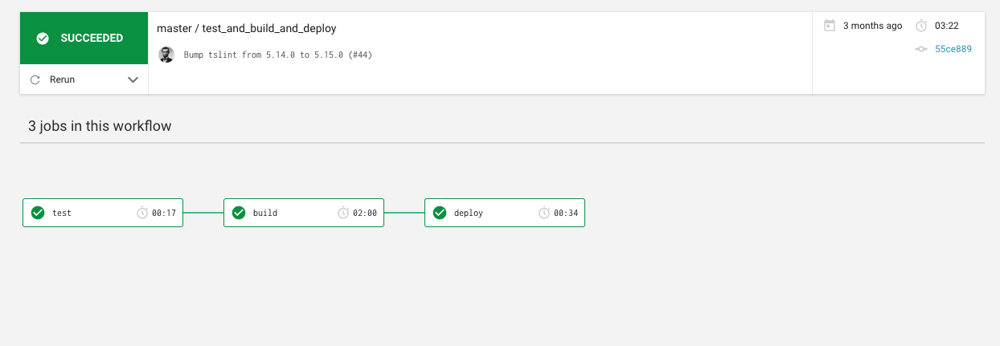

As a web dev, I really only have simple CI needs. I need to lint and run tests on all my branches, including pull requests for public repositories, and deploy only my default branch, often using SSH or other private key deploys. Certainly I need to make sure we don't deploy PRs or non-default branches! For a public project I think these are some pretty common considerations.

I dug through the CI options that are out there for a small Node.JS project of mine. I didn't expect to receive much in the way of public contribution, but I took the opportunity to learn what my options are!

For example's sake, let's say we need to deploy master branch only, but run linting and unit tests on every branch (including forks). Our deploy here will be pushing a Docker image to DockerHub, SSHing into a remote server using a private key, running a few commands to pull and start the image, and exiting.

### [Travis CI](https://travis-ci.com/)

Travis has been around a while, and leans towards brevity instead of verboseness, it seems. `travis.yml` config uses predefined steps in builds, and allows some parallelism. As far as I know, Travis doesn't cache builds. Here's what our config would look like in Travis:

```yaml
sudo: required
dist: trusty

language: node_js
node_js:
  - "10"

services:
  - docker

install:
  - npm ci .
  - npm run build
  - npm run lint

script:
  - if [ "$TRAVIS_PULL_REQUEST" = "false" ]; then travis_retry docker login -u="$DOCKER_USERNAME" -p="$DOCKER_PASSWORD";
    npm prune --production;
    travis_retry docker build -t $DOCKER_USERNAME/$SERVICE:$TRAVIS_BRANCH -f ./docker/Dockerfile .;
    travis_retry docker push $DOCKER_USERNAME/$SERVICE:$TRAVIS_BRANCH;
    fi
  - if ["$TRAVIS_BRANCH" = "master"] && [ "$TRAVIS_PULL_REQUEST" = "false" ]; then ssh $SSH_USER@$SSH_HOST "docker-compose pull $SERVICE && docker-compose stop $SERVICE && docker-compose rm -fv $SERVICE && docker-compose up -d $SERVICE"

after_success: true
```

So this approach is a bit wordy, with a lot of inline environment variable checks. On pushes to Travis-enabled repos, this file is always ran (and on PRs if enabled). There's no way to run only parts of the file depending on the type of branch you're on, so we have to manually check it. One scary downfall: we have to ensure we're not actually building a PR and deploying it when a PR is made against master! We do use a lot of environment variables here, including SSH addressing and keys stored in Travis.

In short, Travis makes us hardcode a lot of logic, and it's a bit scary when you open up your code to the world and possibly allow strangers to redeploy your service just by opening a PR. For simple branch linting and testing, Travis is fine. I wasn't pleased with the deploy options however.

### [Shippable](http://docs.shippable.com/ci/why-continuous-integration/)

Shippable is a complex beast. For simple CI jobs, it's as simple as Travis can be. However for gated deployments and branch specific logic we have to have verbose environment checks, or use the enterprise-level Pipelines that Shippable is built around. Shippable does cache build directories, so that can speed up your builds a bit.

```yaml
language: node_js
node_js: 8.11.1
env:
  global:
    - secure: >-
        qbPjiKuFrvMThhg8hqpoNE7c0URwbxugacM4pSAULLy7ULLoJzFXR3uVXD8mof0Iaec/1ttsaRPFfhut5QpDveQsSJR3V3fwl8SmUWdUOsa7jQMawecaO6av12314098098zlkujqoin123pmn7zcxLYT1ZqgrVTZz+EkHoNVMFITZhuct/2R1sd5Rxi22lWHFuIQo9mCWH13fXuZq+HpbJd42Oig4Z0nBCa0U76NjhmFwC5s90JcSxjTqzG1OaMDgTcthAVEq1CM+idRbLmRLj854C3jSVBalLxZeW1M+uJOE+m0G/ve8kjcpygYpKPRmEvza/zDgupm27i1bQ==

build:
  cache: true
  cache_dir_list:
    - $SHIPPABLE_BUILD_DIR/node_modules
  pre_ci_boot:
    image_name: node
    image_tag: 8.11.1
    pull: true
    options: '-e HOME=/root'
  ci:
    - shippable_retry npm ci . --unsafe-perm
    - npm run build
    - npm run lint

  post_ci:
  	- shippable_retry docker login -u="$DOCKER_USERNAME" -p="$DOCKER_PASSWORD"
    - npm prune --production
    - docker build -t $DOCKER_USERNAME/$SERVICE:$BRANCH -f ./docker/Dockerfile .;
    - if [[ "$IS_PULL_REQUEST" != true ]]; then shippable_retry docker push $DOCKER_USERNAME/$SERVICE:$BRANCH; fi
    - if ["$BRANCH" = "master"] && [ "$IS_PULL_REQUEST" = "false" ]; then ssh $SSH_USER@$SSH_HOST "docker-compose pull $SERVICE && docker-compose stop $SERVICE && docker-compose rm -fv $SERVICE && docker-compose up -d $SERVICE"
```

Again, we have some verbose environment variable checks. We are pushed to use these logic gates and manual deploy processes, making maintenance a bit more complicated. We use SSH keys encrypted in the Shippable UI and can put these inside the file, which can be either a convenience or a hassle depending on how often you need to change them.

In all, Shippable requires basically the same amount of scripting (and thus possibility for error!) that Travis requires.

### [CircleCI](http://docs.shippable.com/ci/why-continuous-integration/)

My clear winner here, CircleCI strikes a really good balance of being powerful/efficient while also being simple enough for small projects where you might not necessarily need a multistep CI process. Here's the code:

```yaml
version: 2
workflows:
  version: 2
  test_and_build_and_deploy:
    jobs:
      - test
      - build:
          requires:
            - test
          filters:
            branches:
              only: master
      - deploy:
          requires:
            - build
          filters:
            branches:
              only: master
jobs:
  test:
    working_directory: ~/my-app
    docker:
      - image: circleci/node:10
    steps:
      - checkout
      - restore_cache:
          key: dependency-cache-{{ checksum "package.json" }}
      - run:
          name: Install Deps
          command: npm install
      - save_cache:
          key: dependency-cache-{{ checksum "package.json" }}
          paths:
            - ./node_modules
      - run:
          name: Test
          command: npm test
      - run:
          name: Lint
          command: npm run lint
      - run:
          name: Build JS
          command: npm run build

  build:
    working_directory: ~/my-app
    docker:
      - image: circleci/node:10
    steps:
      - checkout
      - setup_remote_docker:
          docker_layer_caching: true
      - restore_cache:
          key: dependency-cache-{{ checksum "package.json" }}
      - run:
          name: Install deps
          command: npm install
      - run:
          name: Build JS
          command: npm run build
      - run:
          name: Build for DockerHub
          command: |
            docker build -t $DOCKER_USERNAME/$SERVICE:$CIRCLE_BRANCH -f ./docker/Dockerfile .
            docker login -u="$DOCKER_USERNAME" -p="$DOCKER_PASSWORD"
            docker push $DOCKER_USERNAME/$SERVICE:$CIRCLE_BRANCH
  deploy:
    machine:
      enabled: true
    steps:
      - run:
          name: Deploy Over SSH
          command: |
            ssh $SSH_USER@$SSH_HOST "cd bots && docker-compose pull $SERVICE && docker-compose stop $SERVICE && docker-compose rm -fv $SERVICE && docker-compose up -d $SERVICE"
```

While the configuration file is almost twice as long, I find this config much easier to understand. In CircleCI you have `jobs`, which can be arranged in whatever form of parallelism you need via Workflows. If you don't use workflows, CircleCI expects a single job named `build`. You can see that these three jobs should be ran successfully, however, you may have complicated test suites that can be run in parallel. This can be done by simply not requiring any other steps before running the others. CircleCI bills based on time, and parallel jobs run concurrently, so this is a good way to fit your budget.

I find CircleCI's configuration really straightforward - no logic within each job, and plenty of named steps that can be shown in the web interface and remove the need for comments in your config. If you need to tweak your workflow, or add a job to be run in parallel to another, this is the most clear formatting.

In addition, CircleCI is _fast_. For example - my test job takes less than 20 seconds to run. This is achieved by caching my `node_modules` and busting the cache when my `package.json` is updated. I also find the Workflow diagram to be clear and concise - when playing around with parallelism this helped me understand what I was doing and finding any bugs. Great for onboarding other devs or coming back to a project after a while.



### Overview

Through experimenting with Travis, Shippable, and CircleCI for some simple CI steps and deployment, I've found CircleCI to be the most verbose, the easiest to work with, and the least prone to failure due to a scripting bug or otherwise. I found Travis and Shippable to not be powerful enough for what I need - which is ironic because I only needed to run tests and build and deploy a Docker image. Without considering costs (Travis and CircleCI have free plans, Shippable's is a tiny free plan), I still consider CircleCI to be the best and least failure-prone service to use. Their caching, workflows, and great user interface give me the most confidence in my work. I choose to use CircleCI for all of my personal projects.
