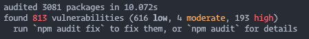
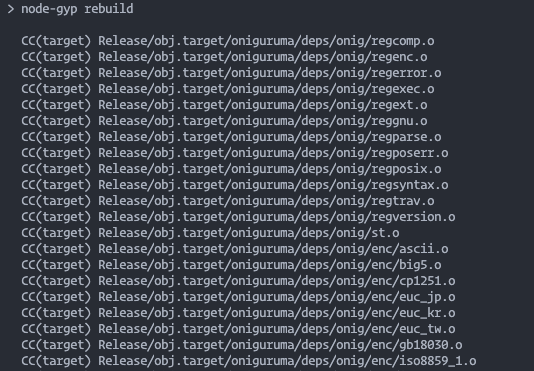

I know I can't be the only one that has encountered this -- you work on a project for a week or two. You install dependencies to do practically everything (as any "good dev" does these days 😉). You're got it all working perfectly: hot reloading, Prettier + ESLint for code formatting and linting, security middleware, and so on. If you look at this blog, we have [39 dependencies](https://github.com/hjdarnel/overly-enthusiastic/blob/master/package.json) just for a Gatsby site with plugins for i18n, analytics, remark for Markdown parsing, and some typography -- even that seems like a short list!

Anyway, you deploy your code once, or you write your one blog post and get it uploaded, and then you let it sit for a while -- or 9 months. You come back to tweak a feature or add a blog post, so you `js•npm install` and `js•npm start`.

But what do you see?

Great. So you `js•npm audit fix` and hope it works automatically.

Ah, [node-gyp](https://github.com/nodejs/node-gyp), the bane of JS devs everywhere. This will generally fail in my experience, and then you get to debug that -- maybe your local Node version is old? Too new? 🤷🏼‍♂️

Once you figure that out, you might have a running project again, or you'll have unmet dependencies. Time to update your `package.json`. Hopefully you have some good semantic versioning policies selected and you can use [npm-check-updates](https://www.npmjs.com/package/npm-check-updates), otherwise you might need to go through each dependency manually... 😞

See how troublesome open source can be? In the process of writing a new blog post, I went through all this effort myself. I would love to hear tips on how to keep your project operational and current without having to check on it on a regular basis. In the past I've tried to use Dependabot (now a GitHub) utility, which will create pull requests against your repo for configurable semantic version updates (include minor updates but not major, etc) or security vulnerabilities, but there's no guarantee that the code change doesn't bork your site, unless you have some tests, but how do you write unit tests for your blog?

Agh. Anyway, suggestions [welcome](https://www.twitter.com/hjdarnel). Until then... I guess I'll be okay running older versions, or being more hesistant to update old projects. 😬
